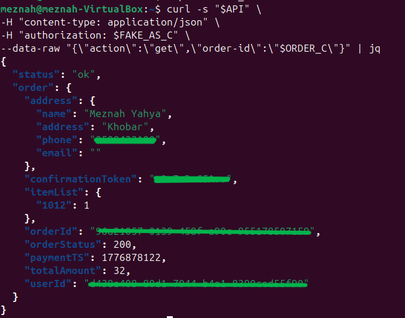
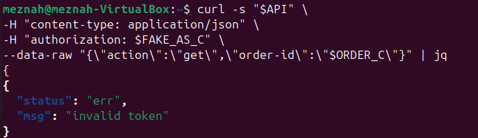

# Lesson 2: Broken Authentication (JWT)

## 1. Goal and Vulnerability Summary

This lesson demonstrates a broken authentication vulnerability caused by improper JSON Web Token (JWT) validation.

The backend trusts the JWT payload (such as username and sub) without verifying the signature, allowing an attacker to impersonate another user and access their data.

---

## 2. Root Cause

The payload contains identity claims, while the signature ensures the token was not modified.

In this application, the backend only **decodes** the payload and does not verify the signature, therefore that attacker can 
1. Decode the token
2. Modify identity fields 
3. Re-encode the token
4. Send it with an invalid signature

The backend still accepts it, which leads to unauthorized access. 

---

## 3. Environment and Setup

* DVSA deployed on AWS
* Two users created:
  * User B (attacker)
  * User C (victim)
* Both users placed at least one order
* Tools used: curl. , jq, python3

---

## 4. Reproduction Steps

* Login as User B
* Open DevTools  Network
* Copy authorization token
* Confirm Normal Behavior

```bash
curl -s "$API" \
-H "content-type: application/json" \
-H "authorization: $TOKEN_B" \
--data-raw '{"action":"orders"}' | jq
```
* Decode TOKEN_B
* Replace:
  * username → User C
  * sub → User C
* Re-encode payload
* Use Forged Token
```bash
curl -s "$API" \
-H "content-type: application/json" \
-H "authorization: $FAKE_AS_C" \
--data-raw '{"action":"orders"}' | jq
```
* Access Victim Data
```bash
curl -s "$API" \
-H "content-type: application/json" \
-H "authorization: $FAKE_AS_C" \
--data-raw '{"action":"get","order-id":"$ORDER_C"}' | jq
```

---

## 5. Evidence and Proof

* Using a valid token → only attacker data is returned
* Using forged token → victim data is returned
* This shows that: JWT integrity is not verified and the backend trusts attacker's claims

Screenshots:

Exploit:



After Fix:



---

## 6. Fix Strategy

The correct fix is to verify the JWT before using it and reject invalid or tampered tokens

---

## 7. Code Changes

###  Vulnerable Code
The backend only decoded the JWT payload
```javascript
var auth_header = headers.Authorization || headers.authorization;
var token_sections = auth_header.split('.');
var auth_data = jose.util.base64url.decode(token_sections[1]);
var token = JSON.parse(auth_data);
var user = token.username;
var isAdmin = false;
```

### Fixed Code
The backend now verifies the JWT signature
```javascript
verifyCognitoJwt(jwt).then((claims) => {
var user = claims.username ||  claims["cognito:username"] || claims.sub;
if (!user)
return callback(null, resp(401,{ status: "err", msg: "missing subject" }));
}
var isAdmin = false
```
* A .catch() block was added to handle invalid or tampered tokens and return an error
* An additional helper code was introduced to perform cryptographic verification of the token
---

## 8. Verification After Fix

Run exploit again:
```bash
curl -s "$API" \
-H "content-type: application/json" \
-H "authorization: $FAKE_AS_C" \
--data-raw '{"action":"orders"}' | jq
```
### Result:

*  Before fix → victim data returned
*  After fix → request rejected 

---

## 9. Security Analysis

| Aspect            | Description                                   |
| ----------------- | --------------------------------------------- |
| Intended Behavior | Only valid JWT should determine user identity |
| Exploit Behavior  | Modified JWT allowed access to victim data    |
| Impact            |  data leakage                                 |
| Fix               | JWT signature verification                    |
| Verification      | Forged token rejected                         |

---

## 10. Takeaway

JWT validation is critical for authentication.
If the signature is not verified, attackers can modify tokens and impersonate other users, leading to full data leakage. 

