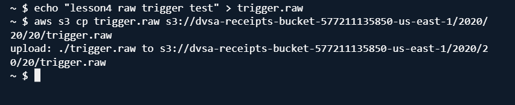
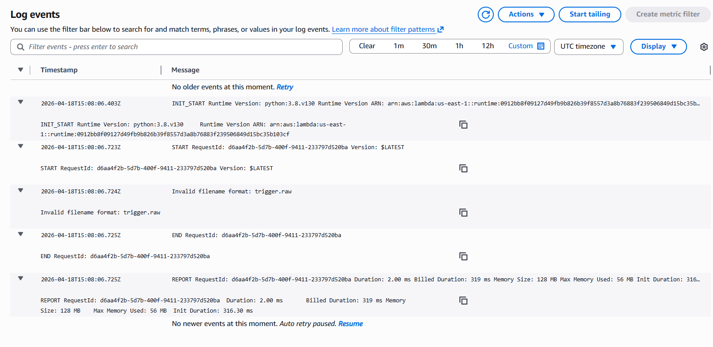

# Lesson 4: Insecure Cloud Configuration 

## 1. Goal and Vulnerability Summary

This lesson demonstrates an insecure cloud configuration where an S3 bucket may allow unauthorized file uploads and trigger backend processing.
If an attacker can upload a malicious file, it may be processed by a Lambda function, leading to unintended behavior.

---

## 2. Root Cause

The issue happens when the S3 bucket is not properly restricted and accepts user-controlled files.
An attacker can: puload files to the bucket, control file name and content,trigger Lambda execution.
The backend then processes this input, which creates a security risk.

---

## 3. Environment and Setup

* DVSA deployed on AWS  
* S3 bucket used for storing files  
* Lambda function processes uploaded files  
* Tools used: AWS CLI, AWS Console  

---

## 4. Reproduction Steps

* Locate and open the receipts bucket.
* . Go to the Permissions tab and observe that Block Public Access is disabled
* Create a test file:
```bash
echo "lesson4 test" > trigger.raw
```
* Upload file to S3:
```bash
aws s3 cp trigger.raw s3://dvsa-receipts-bucket-<....>-/2020/20/20/trigger.raw
```
* This triggers the Lambda function
* Modify the Lambda function code to validate filename before processing.

---

## 5. Evidence and Proof

* File upload succeeded  
* Lambda function was triggered  
* Initial behavior caused an error due to unexpected filename format

Screenshots:

Uploading a file:



Attempting to process it:


This shows that:
* The system processes user's files  
* No validation was initially enforced  

---

## 6. Fix Strategy

The fix is to validate the uploaded file before processing it.

* Check file format  
* Ensure expected naming pattern  
* Reject invalid inputs  

---

## 7. Code Changes

### Vulnerable Code
The backend processed the filename directly without validation.
```python
userId = order.split("-")[1].replace(".raw", "")
```

---

### Fixed Code
Validation was added before processing:
```python
if not file_name.endswith('.raw') or "_" not in file_name:
    print("Invalid filename format:", file_name)
    return {
        "statusCode": 400,
        "body": "invalid file name format"
    }
```

* Now invalid files are rejected  
* Prevents unexpected input from being processed  

---

## 8. Verification After Fix

After applying the fix:

* Re-uploaded the same file  
* Lambda function no longer crashes  
* Invalid input is detected and rejected  



---

## 9. Security Analysis

| Aspect            | Description                                      |
|------------------|--------------------------------------------------|
| Intended Behavior | Only valid files should be processed             |
| Exploit Behavior  | Uploaded file triggered processing               |
| Impact            | Unexpected behavior                              |
| Fix               | Input validation on filename                     |
| Verification      | Invalid input rejected                           |

---

## 10. Takeaway

Allowing user's files into backend processing is risky.
Even simple inputs like file names can cause unexpected behavior if not validated.
Proper validation and restricted access are essential in serverless systems.
