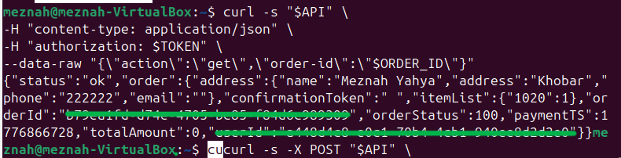
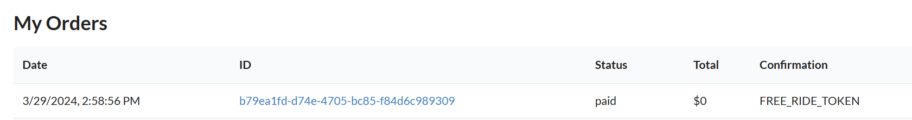
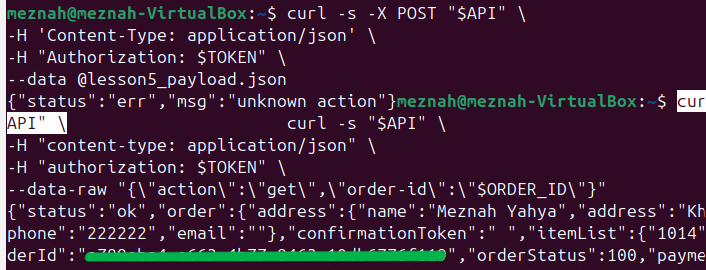

# Lesson 5: Broken Access Control

## 1. Goal and Vulnerability Summary

This lesson demonstrates a Broken Access Control vulnerability in the DVSA system.
A normal user can exploit the public order function and reach a hidden admin function (DVSA-ADMIN-UPDATE-ORDERS).  
This allows the attacker to modify sensitive fields such as the order status without completing payment.

---

## 2. Root Cause

The vulnerability occurs due to two main issues:
1. The public function (DVSA-ORDER-MANAGER) allows unsafe input handling.
2. The admin function (DVSA-ADMIN-UPDATE-ORDERS) does not properly verify if the user is an admin  
Because of this, an attacker can: trigger the admin function and modify order status without authorization  

---

## 3. Environment and Setup

* DVSA deployed on AWS  
* Lambda functions:
  * DVSA-ORDER-MANAGER  
  * DVSA-ADMIN-UPDATE-ORDERS  
* Tools used: curl, DevTools  

---

## 4. Reproduction Steps

* Create a new order (without completing payment)
* Check order status:
```bash
curl -s "$API" \
-H "content-type: application/json" \
-H "authorization: $TOKEN" \
--data-raw '{"action":"get","order-id":"$ORDER_ID"}'
```

* Confirm status = 100 (unpaid)
* Prepare a malicious payload (lesson5_payload.json)
* Execute attack:
```bash
curl -s -X POST "$API" \
-H "Content-Type: application/json" \
-H "Authorization: $TOKEN" \
--data @lesson5_payload.json
```
* Retrieve order again

---

## 5. Evidence and Proof

* Before attack → orderStatus = 100 (unpaid)  
* After attack → orderStatus = 120 (paid)  
* confirmationToken changed to FREE_RIDE_TOKEN  

This shows that:
* A normal user was able to perform admin actions  
* Access control is broken  

### Before Attack:



### After Attack:



---

## 6. Fix Strategy

The fix requires securing both functions:
* Prevent code injection in DVSA-ORDER-MANAGER  
* Add admin verification in DVSA-ADMIN-UPDATE-ORDERS  
* Restrict access so public functions cannot call admin functions  

---

## 7. Code Changes

### Vulnerable Code
The system allowed unsafe input handling and no admin check.

```javascript
var req = serialize.unserialize(event.body);
```

---

### Fixed Code

Input handling was secured and admin validation added.

```javascript
var req = JSON.parse(event.body);
```

```python
if is_admin != "true":
    return {"status": "err", "msg": "forbidden"}
```

* Admin role is now verified before updating orders  

---

## 8. Verification After Fix

* Re-run the same attack  
* Order status does NOT change  

### Result:

* Before fix → attacker changed order to paid  
* After fix → request rejected / no change

Attack failed after the fix:



---

## 9. Security Analysis

| Aspect            | Description                                  |
|------------------|----------------------------------------------|
| Intended Behavior | Only admins can update order status          |
| Exploit Behavior  | Normal user updated order status             |
| Impact            | Bypass payment process                       |
| Fix               | Admin check + safe input handling            |
| Verification      | Attack fails                                 |

---

## 10. Takeaway

Access control must always be enforced in backend systems.
Even if admin functionality exists separately, it must be protected with proper authorization checks.  
If not, attackers can misuse public endpoints to perform malicious operations.
