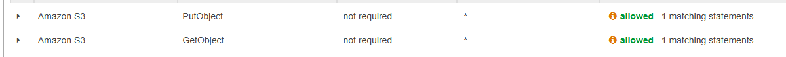
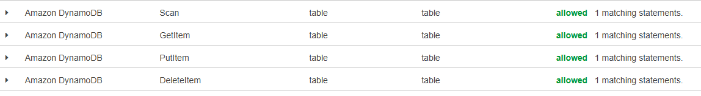
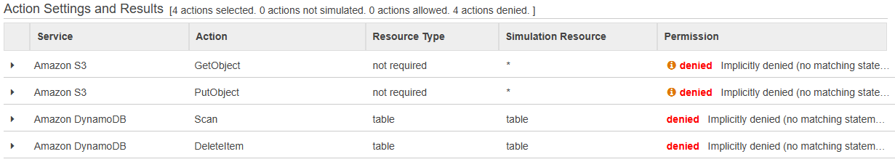

# Lesson 7: Over-Privileged Function

## What is this?
The DVSA-SEND-RECEIPT-EMAIL Lambda function has permissions. It can read and write any S3 bucket and any DynamoDB table in the account, even though it only needs to send receipt emails.

## How to Reproduce
1. Go to Lambda → DVSA-SEND-RECEIPT-EMAIL → Configuration → Permissions
2. Click the execution role
3. Open IAM Policy Simulator and test S3 GetObject and DynamoDB Scan on any resource
4. Both show Allowed



## Fix applied
Restricted all three policies to only the resources the function actually needs.

### Policy 1
Before:
```json
{
    "Statement": [{
        "Action": ["s3:GetObject","s3:ListBucket","s3:PutObject","s3:DeleteObject",...],
        "Resource": ["arn:aws:s3:::*","arn:aws:s3:::*/*"],
        "Effect": "Allow"
    }]
}
```

After:
```json
{
    "Statement": [{
        "Action": ["s3:GetObject","s3:PutObject"],
        "Resource": ["arn:aws:s3:::dvsa-*receipts*/*"],
        "Effect": "Allow"
    }]
}
```

### Policy 2
Before:
```json
{
    "Statement": [{
        "Action": ["dynamodb:GetItem","dynamodb:Scan","dynamodb:PutItem","dynamodb:DeleteItem",...],
        "Resource": ["arn:aws:dynamodb:us-east-1:577211135850:table/*"],
        "Effect": "Allow"
    }]
}
```

After:
```json
{
    "Statement": [{
        "Action": ["dynamodb:GetItem"],
        "Resource": ["arn:aws:dynamodb:us-east-1:577211135850:table/DVSA-ORDERS-DB"],
        "Effect": "Allow"
    }]
}
```

### Policy 3
Before:
```json
{
    "Statement": [{
        "Action": ["sts:GetCallerIdentify"],
        "Resource": "*",
        "Effect": "Allow"
    }]
}
```

After:
```json
{
    "Statement": [{
        "Action": ["ses:SendEmail","ses:SendRawEmail"],
        "Resource": "*",
        "Effect": "Allow"
    }]
}
```

Also removed AmazonSESFullAccess policy.

## Verification
IAM Policy Simulator now shows Denied
