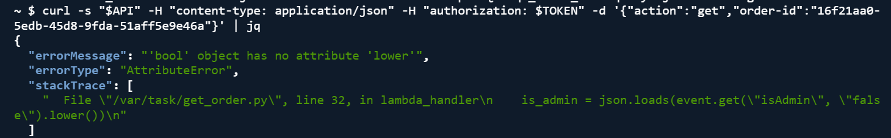
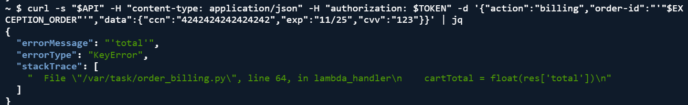
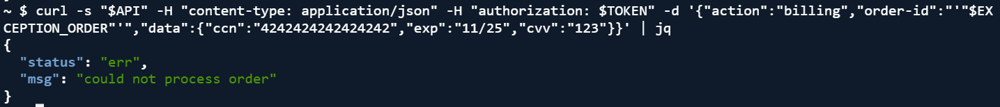
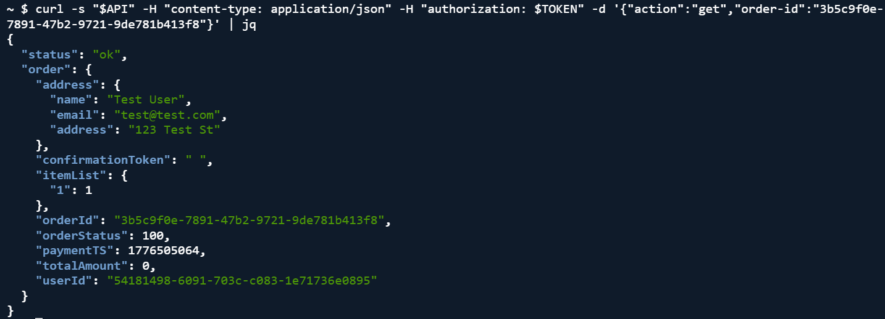

# Lesson 10: Unhandled Exceptions

## What is this?
When bad requests are sent to the backend, Lambda functions crash and return full stack traces to the user. This leaks internal file names, line numbers and source code.

## How to attack
```bash
export API="https://nuxbyqip03.execute-api.us-east-1.amazonaws.com/Stage/order"
export TOKEN= #we add the token 
export ORDER_ID= #we add oder id

#Trigger billing exception
curl -s "$API" -H "content-type: application/json" -H "authorization: $TOKEN" \
  -d '{"action":"billing","order-id":"'"$ORDER_ID"'","data":{"ccn":"4242424242424242","exp":"11/25","cvv":"123"}}' | jq

#Trigger get order exception  
curl -s "$API" -H "content-type: application/json" -H "authorization: $TOKEN" \
  -d '{"action":"get","order-id":"'"$ORDER_ID"'"}' | jq
```

## What we see
Full stack traces exposing internal file names and source code:
- get_order.py line 32

- order_billing.py line 64



## Fix 1: order_billing.py
Before:
```python
res = json.loads(req.data)
cartTotal = float(res['total'])
missings = res.get("missing", {})
```

After:
```python
try:
    res = json.loads(req.data)
    cartTotal = float(res['total'])
    missings = res.get("missing", {})
except (KeyError, ValueError, Exception) as e:
    print("Billing error (internal):", str(e))
    return {"status": "err", "msg": "could not process order"}
```

## Fix 2: get_order.py
Before:
```python
is_admin = json.loads(event.get("isAdmin", "false").lower())
```

After:
```python
is_admin_raw = event.get("isAdmin", "false")
if isinstance(is_admin_raw, bool):
    is_admin = is_admin_raw
else:
    is_admin = json.loads(str(is_admin_raw).lower())
```

## Verification
After the fix both endpoints return  generic error messages with no details leaked.

